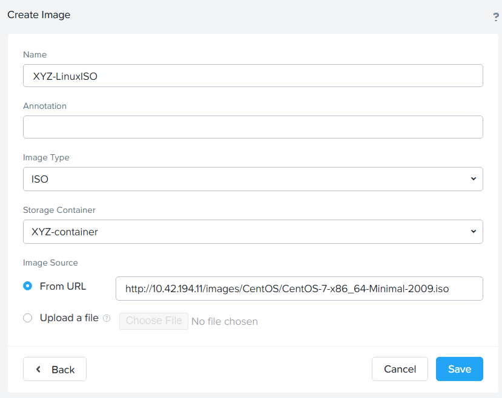

.. _image_configuration:

###################
Image Configuration
###################

Nutanix's Image Service is where you can store ISOs, as well as other disk images.

While we already staged some disk images ahead of this bootcamp it's now time for you to upload an ISO.

#. From the drop-down menu, choose **Settings**, and then **Image Configuration** from the left-hand menu.

#. Click :fa:`plus` **Upload Image**.

#. Fill out the following fields and click **Save**:

  - **Name** - *Initials-LinuxISO*
  - **Image Type** - ISO
  - **Storage Container** - *Initials*-container
  - **Image Source** - Select **From URL**, and then enter `http://10.42.194.11/images/CentOS/CentOS-7-x86_64-Minimal-2009.iso` in the field.

Takeaways
=========

   - Image management in Prism Central allows you to upload images that can deploy workloads in any of the clusters registered to that Prism Central instance.
   - An image can also be uploaded directly from a cluster's Prism Element.
   - This tool can also convert VM disk images to formats that AHV can understand.
   - The image service supports raw, vhd, vhdx, vmdk, vdi, iso, and qcow2 disk formats.