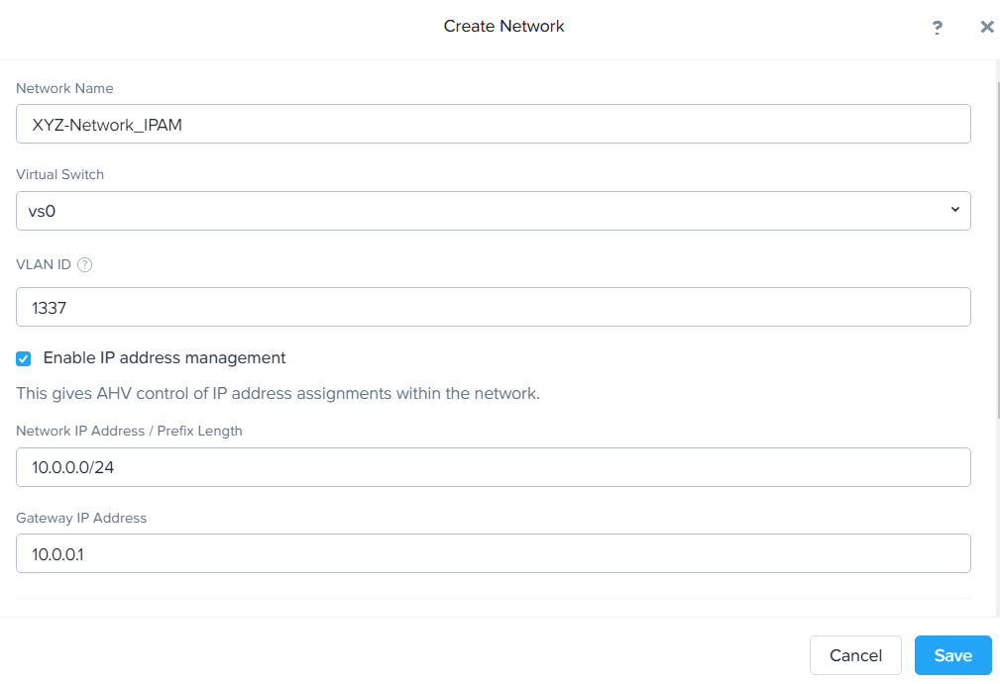

.. _network_configuration:

#####################
Network Configuration
#####################

Overview
========

In this section, you will learn how to set up a network. The networks you create in the steps below provide VMs with connectivity by assigning the appropriate networks for the VM's respective NICs.

AHV Networking Background
=========================

AHV leverages Open vSwitch (OVS) for all VM networking. OVS is an open-source software switch implemented in the Linux kernel and designed to work in a multiserver virtualization environment. Each AHV server maintains an OVS instance, and all OVS instances combine to form a single logical switch.

Each node is typically uplinked to a physical switch port trunked/tagged to multiple VLANs, exposed as virtual networks.

VM networking is configured through Prism (or optionally CLI/REST), making network management in AHV very simple.

With AHV, you can also set up a DHCP server to automatically provide IP addresses for VMs on that network using the IP address management (IPAM) service. IPAM can potentially make network management more straightforward, as you wouldn't have to set up a separate DHCP server for the network.

Additional details about AHV networking can be found `here <https://nutanixbible.com/#anchor-book-of-ahv-networking>`_.

Virtual Networks
----------------

- Similar to a VMware *distributed port group*.
- Each virtual NIC (vNIC) belongs to precisely one virtual network.
- Each virtual network is a common point of configuration for a group of vNICs.
- Physical switch port must be configured to trunk VLAN.

   .. figure:: images/network_config_01.png

   .. figure:: images/network_config_02.png

Virtual NICs of VMs
-------------------

- Each vNIC belongs to exactly one virtual network.
- For IPAM-enabled networks, vNICs get life-long static IP assignments.
- User may configure pools to allocate IPs, either automatically or by specifying the IP manually.

   .. figure:: images/network_config_03.png

IP Address Management (IPAM)
----------------------------

- Integrated DHCP Server.
- AHV intercepts DHCP requests from guests on IPAM networks, and injects responses.
- Virtualization admin manages a range of IP addresses.
- Supports arbitrary DHCP options, with UI support for DNS and TFTP configuration.

Configure Network
=================

.. note::

   In the following exercise, you will create networks using invalid VLANs, meaning no VM traffic will be transmitted outside an individual host. This behavior is expected for demonstration/education purposes only.

Create Subnet without IPAM
--------------------------

Connect to Prism Element and create a network for user VM interfaces. Use any VLAN other than 0, and do not enable IP address management.

#. From the main drop-down, choose **VM**.

#. Select **Network Config**, and then click :fa:`plus` **Create Network**.

#. Fill out the following fields and click **Save**:

   - **Subnet Name** - *Initials*-Network
   - **VLAN ID** - A value (< 4096) other than your *Primary* or *Secondary* network VLANs
   - Do not select *Enable IP Address Management*

   The configured virtual network will now be available across all nodes within the cluster. Virtual networks in AHV behave like Distributed Virtual Switches in ESXi, conveying the benefit of not configuring these same settings on each host within the cluster. When creating VMs in IPAM managed networks, the IP can optionally be manually specified during vNIC creation.

Create Subnet with IPAM
-----------------------

Create another network, but this time we will enable IPAM.

#. Fill out the following fields and click **Save**:

   - **Subnet Name** - *Initials*-Network_IPAM
   - **VLAN ID** - A value (< 4096) other than your *Primary** or *Secondary* network VLANs
   - Select **Enable IP Address Management**
   - **Network IP Address / Prefix Length** - 10.0.0.0/24
   - **Gateway** - 10.0.0.1
   - Do not select *Configure Domain Settings*
   - **Create Pool** - 10.0.0.100-10.0.0.150
   - Do not select *Override DHCP Server*

   .. figure:: images/network_config_04.png

   .. note::

     It is possible to create multiple pool ranges for a network.

   The configured virtual network will now be available across all nodes within the cluster. VMs with vNICs on this network will receive a DHCP address from the range specified. This IP assignment lasts for the life of the VM, avoiding the need to depend on DHCP reservations or static IPs for many workloads.

Takeaways
=========

- It's effortless to set up a network in the cluster to establish VM connectivity.
- IPAM is very simple to set up within a network, and it can significantly simplify IP management within the cluster.